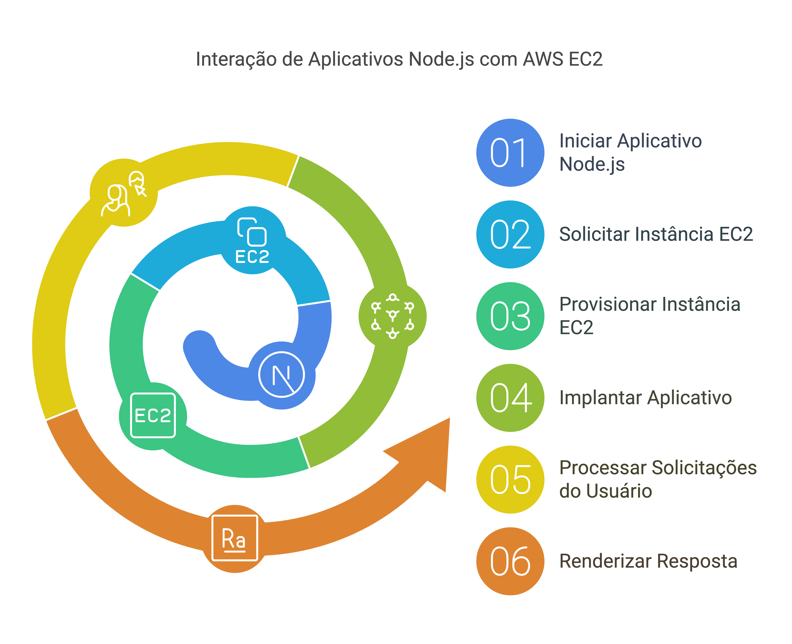
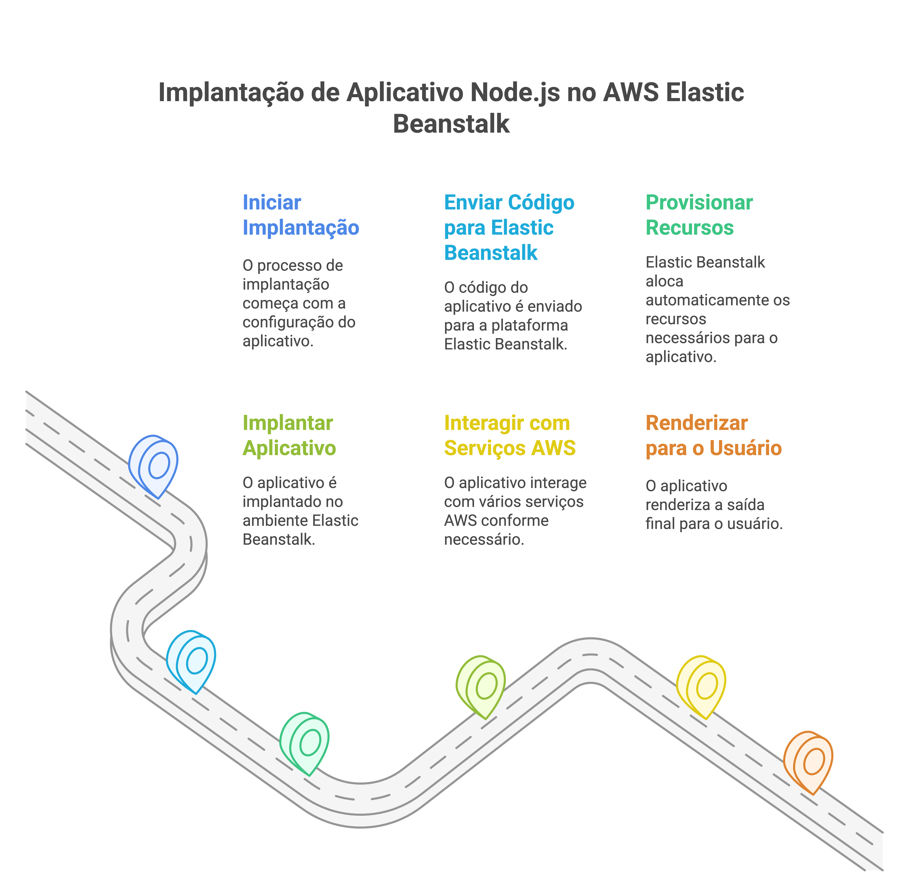
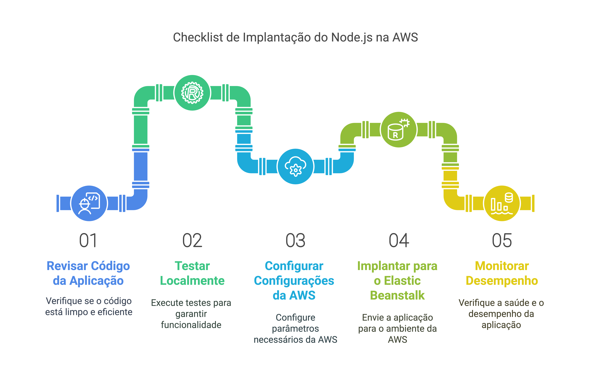

# 🚀 Deploy de uma Aplicação Node.js na AWS  

## 📌 Sobre o repositório  
Este repositório contém materiais e scripts para auxiliar no aprendizado e na prática do **deploy de aplicações Node.js na AWS**. O curso aborda conceitos fundamentais de **EC2, Elastic Beanstalk e IAM**, além do uso de ferramentas essenciais para desenvolvimento e deploy.  

---

## 📂 Estrutura do repositório  

```plaintext
📦 deploy-nodejs-aws
├── 📁 material          # Materiais teóricos das aulas
│   ├── aula1.md        # Introdução e Configuração do Ambiente com Node.js
│   ├── aula2.md        # Módulos e Gerenciamento de Pacotes com NPM
│   ├── aula3.md        # Criando e Iniciando um Servidor com Express.js
│   ├── aula4.md        # Criando Endpoints Simples com CRUD
│   ├── aula5.md        # Trabalhando com Arquivos no Node.js
│   ├── aula6.md        # Middlewares e Tratamento de Erros no Express.js
│   ├── aula7.md        # Conectando Node.js a um Banco de Dados (SQLite ou MongoDB)
│   ├── aula8.md        # Projeto Final - Full Stack com Node.js, React e MongoDB
│   ├── aula9.md        # Deploy Completo do Projeto Full Stack no AWS (Upload do App JS via EC2)
│
├── 📁 scripts           # Códigos utilizados no curso
│   ├── index.js        # Código base para deploy na AWS
│
├── termos.md           # Tradução e explicação de termos JavaScript para PT-BR
└── README.md           # Informações gerais do curso e instalação
```

---

## 🛠️ Ferramentas necessárias  

Antes de iniciar, certifique-se de instalar as ferramentas abaixo:  

### 1️⃣ **Node.js e NPM**  
Utilizados para rodar a aplicação e gerenciar pacotes.  

- 🔗 [Download Node.js](https://nodejs.org/) (Recomenda-se a versão LTS)  
- Após a instalação, verifique se está funcionando corretamente:  
  ```sh
  node -v
  npm -v
  ```

### 2️⃣ **Visual Studio Code (VS Code)**
Editor de código recomendado para desenvolvimento.

- 🔗 [Download VS Code](https://code.visualstudio.com/)

### 3️⃣ **Postman**
Ferramenta para testar APIs de forma simples e interativa.

- 🔗 [Download Postman](https://www.postman.com/downloads/)

### 4️⃣ **MongoDB**
Ferramenta de banco de dados NoSQL, simples e escalável, que armazena dados em documentos JSON.

- 🔗 [Download MongoDB](https://www.mongodb.com/try/download/community)

### 5️⃣ **MongoDB Clusters**
Servidores interconectados para garantir escalabilidade, alta disponibilidade e distribuição de dados.

- 🔗 [Login](https://account.mongodb.com/account/login)

---

## 🌐 Criando uma conta na AWS  

Para utilizar os serviços da AWS, siga os passos abaixo:  

1️⃣ **Acesse o site da AWS**:  
   - 🔗 [Criar Conta AWS](https://aws.amazon.com/)  
   
2️⃣ **Cadastro**:  
   - Preencha os dados necessários (nome, e-mail, telefone, cartão de crédito para verificação).  
   - Escolha o **plano gratuito** (Free Tier) para evitar cobranças no início.  

3️⃣ **Configuração de acesso**:  
   - Após o cadastro, acesse o **AWS IAM** para criar um usuário administrativo com permissões adequadas.  

---

## 🚀 Principais recursos da AWS explorados  

### 1️⃣ **EC2 (Elastic Compute Cloud)**  
- Serviço de instâncias virtuais na AWS.  
- Utilizado para hospedar aplicações e manipular servidores de forma escalável.  

### 2️⃣ **Elastic Beanstalk**  
- Plataforma gerenciada para deploy de aplicações na AWS.  
- Automatiza configurações de infraestrutura, balanceamento de carga e escalabilidade.  

### 3️⃣ **IAM (Identity and Access Management)**  
- Serviço de gerenciamento de usuários e permissões na AWS.  
- Importante para configurar acessos seguros à conta AWS.  

---

## 📝 Como utilizar este repositório  

1️⃣ **Estude o material de cada aula**  
   - 📁 Acesse a pasta `material/` e siga a sequência das aulas.  

2️⃣ **Configure seu ambiente**  
   - Instale as ferramentas recomendadas na seção **Ferramentas Necessárias**.  
   - Caso tenha dúvidas sobre algum termo JavaScript, consulte o arquivo [`termos.md`](termos.md).  

3️⃣ **Execute o código do curso**  
   - 📁 Acesse a pasta `scripts/` e abra o arquivo `index.js` no VS Code.  
   - Execute a aplicação com:  
     ```sh
     node scripts/index.js
     ```

4️⃣ **Implemente o deploy na AWS**  
   - Configure sua conta na AWS e siga as aulas sobre **Elastic Beanstalk** para realizar o deploy.  

## Fluxograma EC2



## Fluxograma Elastic Beanstalk



## Checklist de Pré-Deploy


